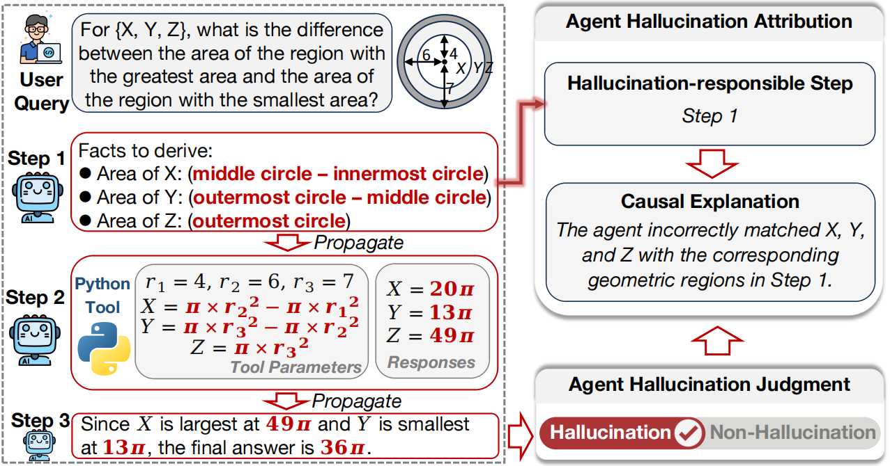

<p align="center">
  <h1 style="display: inline;">
    AgentHallu: Benchmarking Automated Hallucination Attribution of LLM-based Agents
  </h1>
</p>

<!-- <h3 align="center">NeurIPS 2025 Datasets and Benchmarks </h3> -->

<p align="center">
  <a href="https://liuxuannan.github.io/AgentHallu.github.io/">🌐 Homepage</a> •
  <!-- <a href="https://mmvu-benchmark.github.io/#leaderboard">🥇 Leaderboard</a> • -->
  <a href="https://arxiv.org/abs/2601.06818">📖 Paper</a> •
  <a href="">🤗 Data</a>
</p>

## 👋 Overview


### Why AgentHallu Benchmark?
As LLM-based agents operate over sequential multi-step reasoning, hallucinations arising at intermediate steps risk propagating along the trajectory, thus degrading overall reliability.
Unlike hallucination detection in single-turn responses, diagnosing hallucinations in multi-step workflows requires identifying which step causes the initial divergence. 

To fill this gap, we propose a new research task, **automated hallucination attribution** of LLM-based agents, aiming to identify the step responsible for the hallucination and explain why. To support this task, we introduce AgentHallu, a comprehensive benchmark with:
   - **693 high-quality trajectories** spanning **7 agent frameworks** and **5 domains** (World Knowledge, Science, Math, General Assistant, and Tool-Use).
   - a hallucination taxonomy organized into **5 categories** (Planning, Retrieval, Reasoning, Human-Interaction, and Tool-Use) and **14 sub-categories**.
   - **multi-level annotations** curated by humans, covering **binary labels**, **hallucination-responsible steps**, and **causal explanations**.


## 🚀 Quickstart
Code and data will be coming soon!


## License
This dataset is under [CC-BY 4.0](https://creativecommons.org/licenses/by/4.0/) license.


## ✍️ Citation
If you use our work and are inspired by our work, please consider cite us:
```
@article{liu2026agenthallu,
  title={AgentHallu: Benchmarking Automated Hallucination Attribution of LLM-based Agents},
  author={Liu, Xuannan and Yang, Xiao and Li, Zekun and Li, Peipei and He, Ran},
  journal={arXiv preprint arXiv:2601.06818},
  year={2026}
}
```